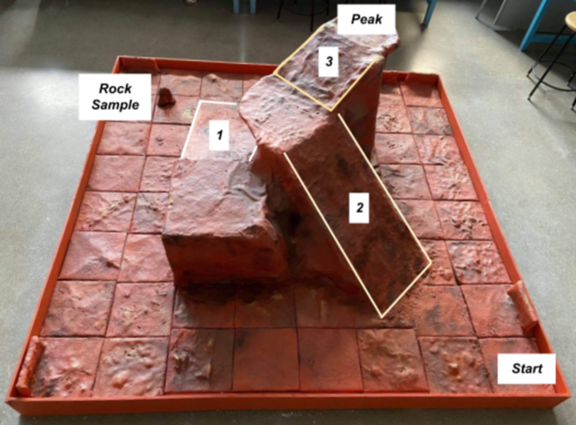

# MRR Mission Terrain Overview

Our rover faces the challenge of a meticulously designed course, mirroring the uneven and rugged terrain of Mars, including a precise replication of Olympus Mons slopes.

Objectives include sample retrieval and summit photography, demanding precision navigation and robust design. 

Explore the challenges and mission parameters in detail.
