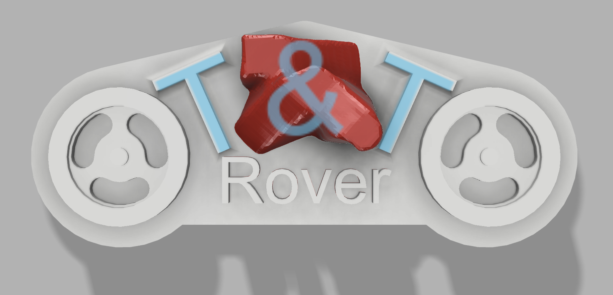
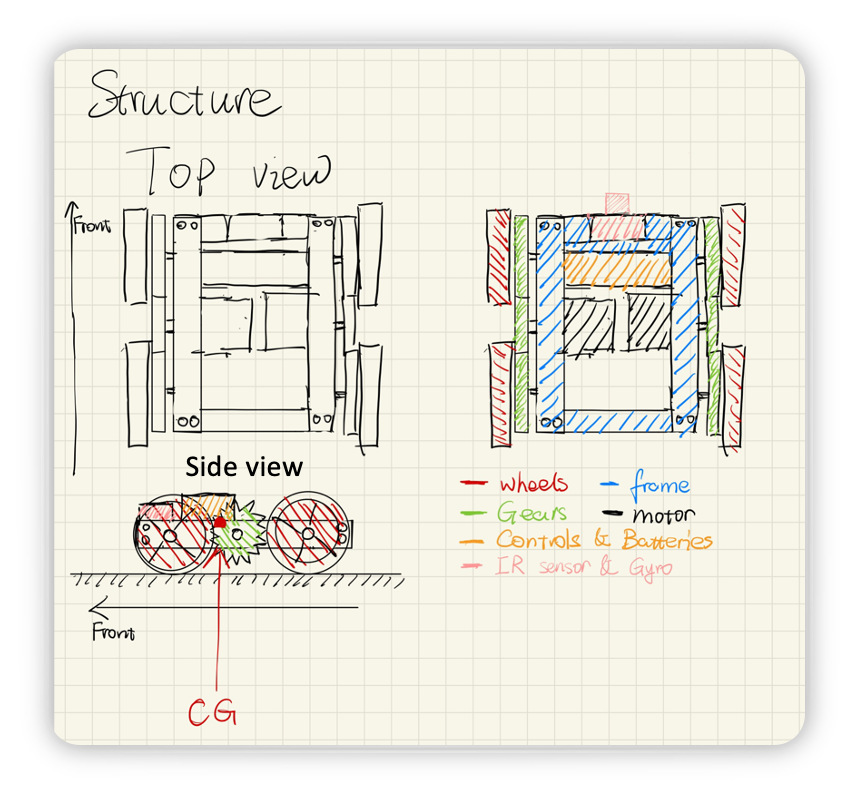
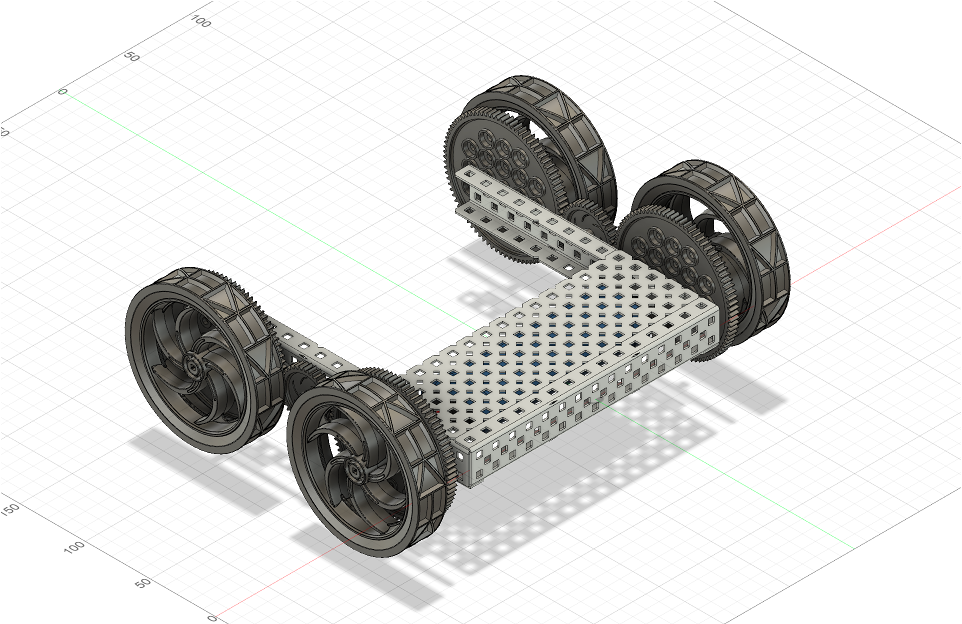

# Tharsis Technologies Rover Division

# [NOTE: THIS IS FOR EDUCATION PURPOSE ONLY](https://manual.eg.poly.edu/index.php/Mars_Rover_Robot_(MRR)) 

Welcome to the Tharsis Technologies Rover Division's official project repository for the Mars Rover Robot (MRR) initiative. 

## About Us
Tharsis Technologies is at the forefront of interplanetary exploration robotics. Our mission is to design and deploy advanced robotic systems for the exploration of Mars, focusing on the detection and analysis of volcanic activity. This project, in collaboration with NASA, aims to traverse and study Olympus Mons, revealing secrets of the Martian environment.

## Project Objectives
- Navigate challenging Martian terrain to collect geological samples.
- Ascend Olympus Mons, capturing detailed photographic evidence.
- Operate autonomously, utilizing advanced sensors for navigation accuracy.

### Discover more about our project's specifications, milestones, and the team behind the innovation: 
- [Specifications](SPECIFICATIONS.md)
- [Milestones & Benchmarks](MILESTONES_BENCHMARKS.md)
- [Course Layout](COURSE_LAYOUT.md)
- [Cost Estimate](COST_ESTIMATE.md)
- [Extra Credit](EXTRA_CREDIT.md)

## Contact Us
For inquiries, collaboration, or more information, reach out at [contact@ttrover.com](mailto:contact@ttrover.com).

Embark with us on this groundbreaking journey to unlock the mysteries of Mars.

@power by [github pages](https://github.com/ttrover/ttrover.github.io)
